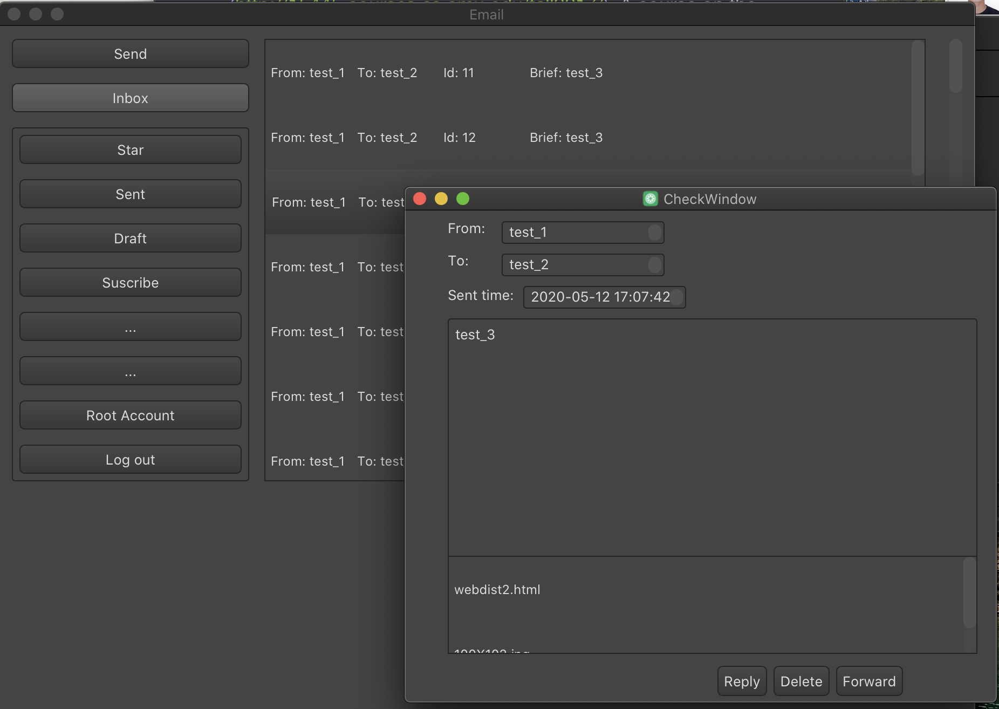

# Email app simulator 
## Intro
Built a Email app simulator by mysql, C++ & QT, supports log/register/send/receive/delete/send appendix file etc..

## Projects

- [x] Checkpoint 1 - build QT frame work

- [x] Checkpoint 1.5 - add tests

- [x] Checkpoint 2 - mysql connection pool 

- [x] Checkpoint 2.5 - add tests

- [x] Checkpoint 3 - appendix read & write

- [x] Checkpoint 3.5 - add tests 

- [ ] Checkpoint 4 - IMAP support 

